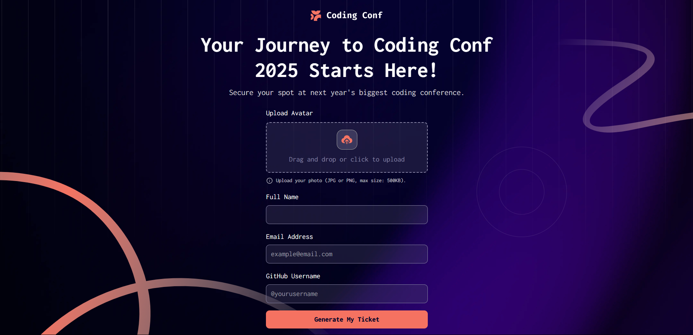

# Frontend Mentor - Conference ticket generator solution

This is a solution to the [Conference ticket generator challenge on Frontend Mentor](https://www.frontendmentor.io/challenges/conference-ticket-generator-oq5gFIU12w). Frontend Mentor challenges help you improve your coding skills by building realistic projects. 

## Table of contents

- [Frontend Mentor - Conference ticket generator solution](#frontend-mentor---conference-ticket-generator-solution)
  - [Table of contents](#table-of-contents)
  - [Overview](#overview)
    - [The challenge](#the-challenge)
    - [Screenshot](#screenshot)
    - [Links](#links)
  - [My process](#my-process)
    - [Built with](#built-with)
    - [What I learned](#what-i-learned)
    - [Continued development](#continued-development)
  - [Author](#author)

## Overview

### The challenge

Users should be able to:

- Complete the form with their details
- Receive form validation messages if:
  - Any field is missed
  - The email address is not formatted correctly
  - The avatar upload is too big or the wrong image format
- Complete the form only using their keyboard
- Have inputs, form field hints, and error messages announced on their screen reader
- See the generated conference ticket when they successfully submit the form
- View the optimal layout for the interface depending on their device's screen size
- See hover and focus states for all interactive elements on the page

### Screenshot

### Links

- Live Site URL: [Click here](https://your-live-site-url.com)

## My process

### Built with

- Semantic HTML5 markup
- CSS custom properties
- [React](https://reactjs.org/) - JS library
- [Tailwind CSS](https://tailwindcss.com/) - For styles

### What I learned

I learned about `useNavigate` hook from `react-router-dom` which is used to navigate to a different route after a form validation.

### Continued development

I will continue to work on the form validation and accessibility features.

## Author

- Frontend Mentor - [@subhajitroycode](https://www.frontendmentor.io/profile/subhajitroycode)
- LinkedIn - [@subhajitroycode](https://www.linkedin.com/in/subhajitroycode)
- Twitter / X - [@subhajitroycode](https://www.twitter.com/subhajitroycode)
